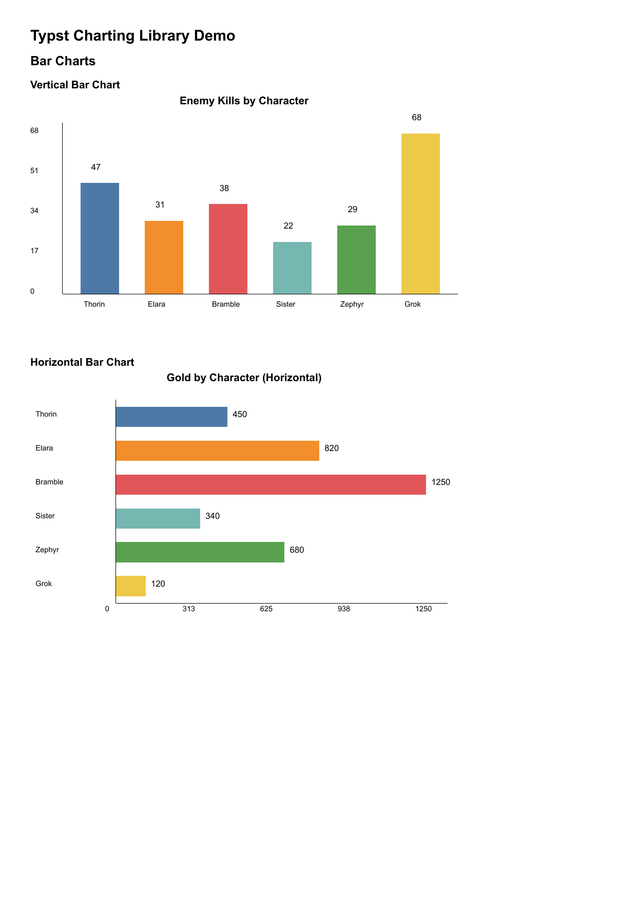
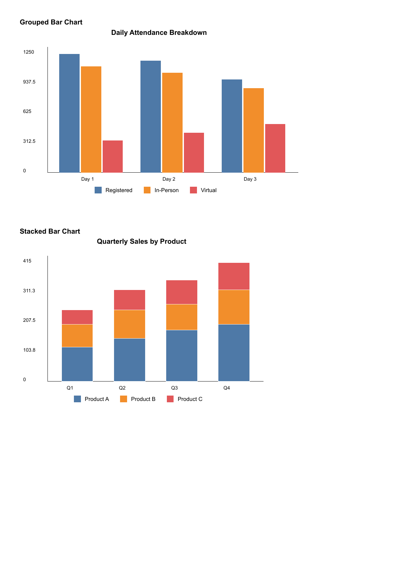
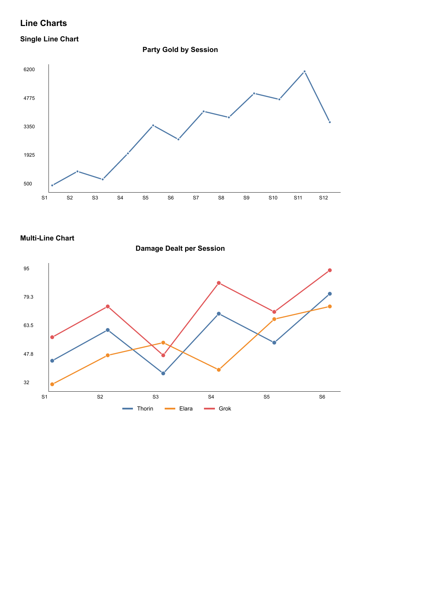
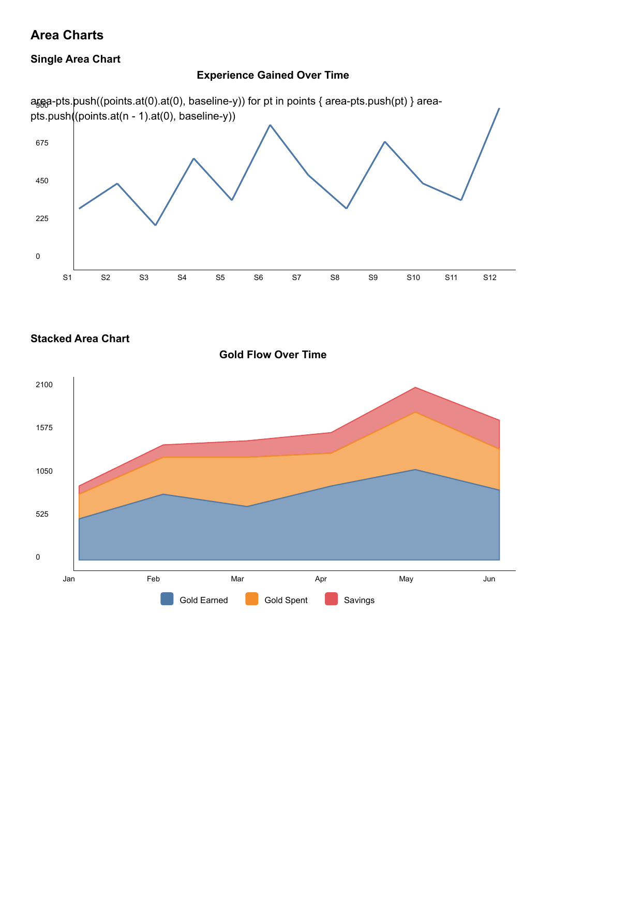
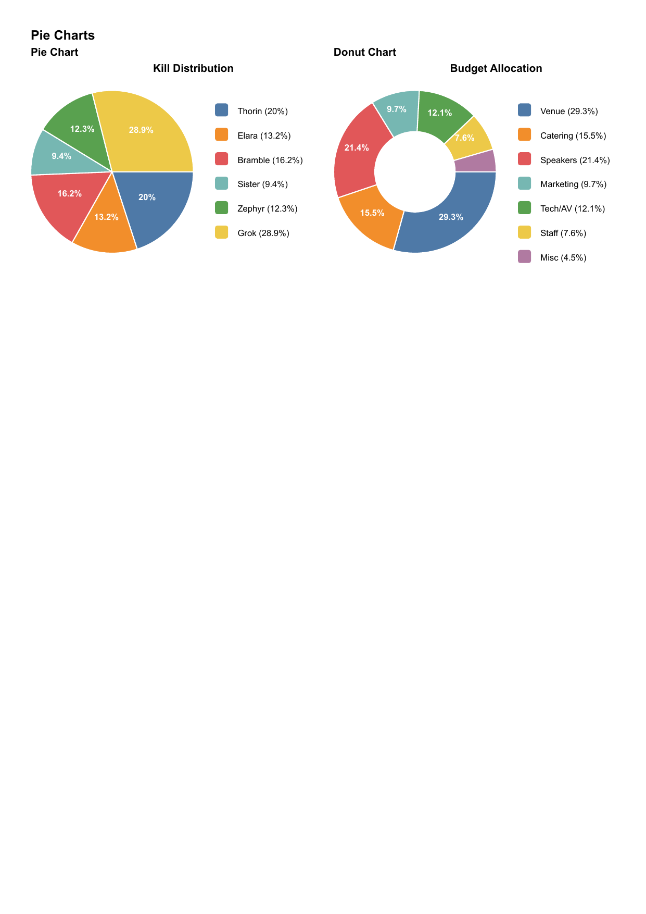
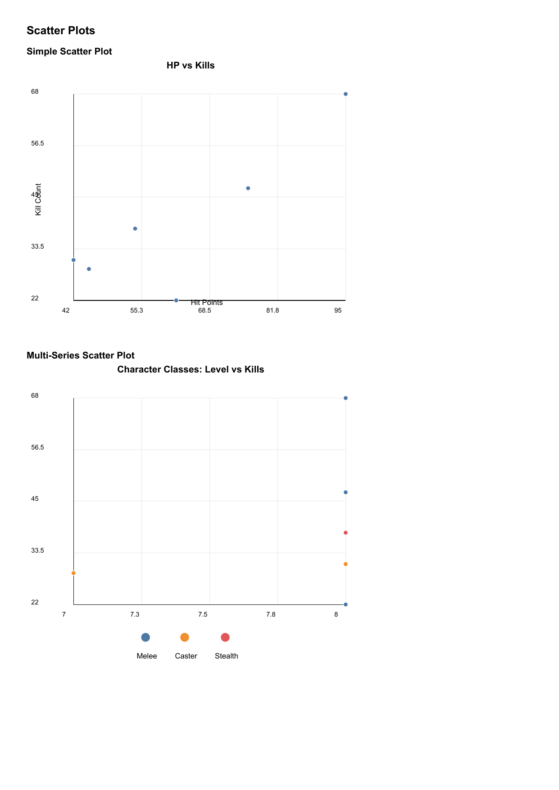
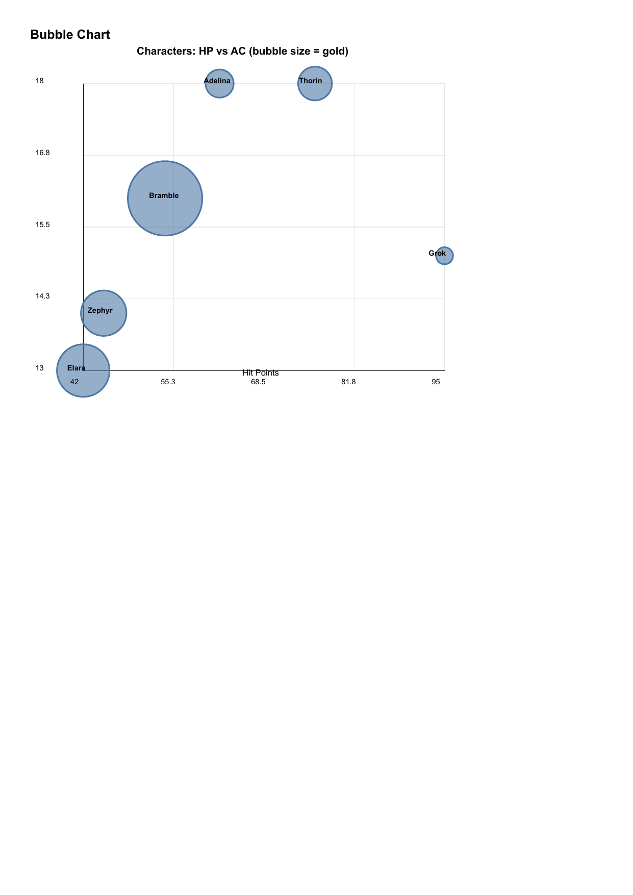
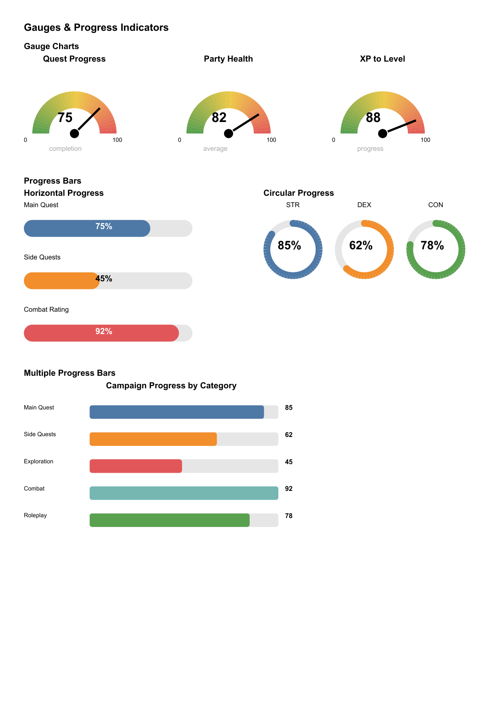
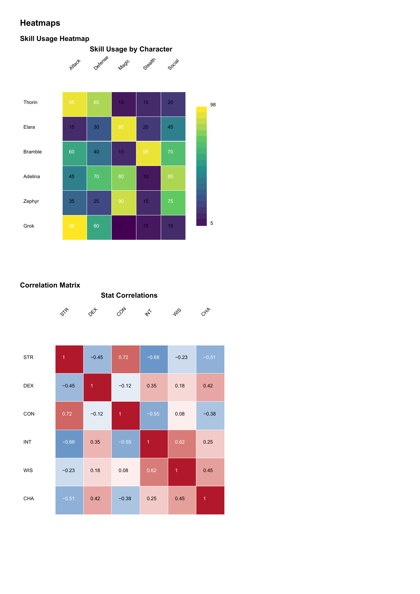
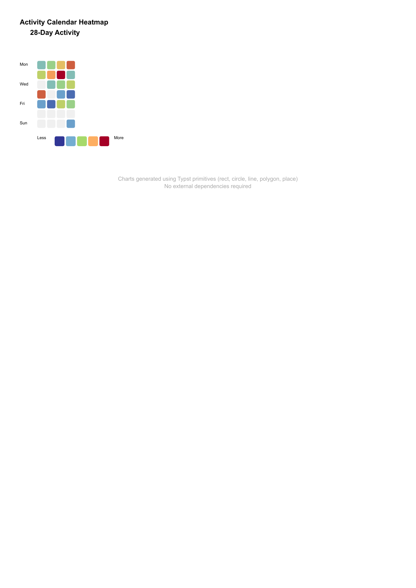

# Typst Charts

A charting library for [Typst](https://typst.app) built entirely with native primitives (`rect`, `circle`, `line`, `polygon`, `place`). No external dependencies required.

## Gallery

### Bar Charts


### Grouped & Stacked Bars


### Line Charts


### Area Charts


### Pie & Donut Charts


### Radar Charts


### Scatter Plots


### Bubble Chart


### Gauges & Progress Indicators


### Heatmaps


### Calendar Heatmap


## Features

- **15+ chart types** for data visualization
- **JSON data input** - load data directly from JSON files
- **Customizable** - colors, sizes, labels, legends
- **Pure Typst** - no packages or external tools needed

## Chart Types

### Bar Charts
- `bar-chart` - Vertical bar chart
- `horizontal-bar-chart` - Horizontal bar chart
- `grouped-bar-chart` - Side-by-side grouped bars
- `stacked-bar-chart` - Stacked bar segments

### Line & Area Charts
- `line-chart` - Single line with points
- `multi-line-chart` - Multiple series comparison
- `area-chart` - Filled area under line
- `stacked-area-chart` - Stacked area series

### Circular Charts
- `pie-chart` - Pie chart with legend
- `pie-chart` (donut mode) - Donut/ring chart
- `radar-chart` - Spider/radar chart

### Scatter & Bubble
- `scatter-plot` - X/Y point plotting
- `multi-scatter-plot` - Multi-series scatter
- `bubble-chart` - Scatter with size dimension

### Gauges & Progress
- `gauge-chart` - Semi-circular dial gauge
- `progress-bar` - Horizontal progress bar
- `circular-progress` - Ring progress indicator
- `progress-bars` - Multiple comparison bars

### Heatmaps
- `heatmap` - Grid heatmap with color scale
- `calendar-heatmap` - GitHub-style activity grid
- `correlation-matrix` - Symmetric correlation display

## Installation

Copy the chart files to your project:

```
chart-common.typ
chart-bar.typ
chart-line.typ
chart-area.typ
chart-pie.typ
chart-radar.typ
chart-scatter.typ
chart-gauge.typ
chart-heatmap.typ
charting.typ
```

## Usage

```typst
#import "charting.typ": *

// Load data from JSON
#let data = json("mydata.json")

// Create a bar chart
#bar-chart(
  (
    labels: ("A", "B", "C", "D"),
    values: (25, 40, 30, 45),
  ),
  width: 300pt,
  height: 200pt,
  title: "My Chart",
)

// Create a pie chart
#pie-chart(
  (
    labels: ("Red", "Blue", "Green"),
    values: (30, 45, 25),
  ),
  size: 150pt,
  donut: true,
)

// Create a radar chart
#radar-chart(
  (
    labels: ("STR", "DEX", "CON", "INT", "WIS", "CHA"),
    series: (
      (name: "Fighter", values: (18, 12, 16, 10, 13, 8)),
      (name: "Wizard", values: (8, 14, 12, 18, 15, 11)),
    ),
  ),
  size: 200pt,
  title: "Character Comparison",
)
```

## Data Formats

### Simple data (labels + values)
```typst
(
  labels: ("Jan", "Feb", "Mar"),
  values: (100, 150, 120),
)
```

### Multi-series data
```typst
(
  labels: ("Q1", "Q2", "Q3"),
  series: (
    (name: "Product A", values: (100, 120, 140)),
    (name: "Product B", values: (80, 90, 110)),
  ),
)
```

### Scatter/bubble data
```typst
(
  x: (1, 2, 3, 4, 5),
  y: (10, 25, 15, 30, 20),
  size: (5, 10, 8, 15, 12),  // for bubble chart
)
```

### Heatmap data
```typst
(
  rows: ("Row1", "Row2", "Row3"),
  cols: ("Col1", "Col2", "Col3"),
  values: (
    (1, 2, 3),
    (4, 5, 6),
    (7, 8, 9),
  ),
)
```

## Examples

See `chart-demo.typ` for comprehensive examples using the included sample data files:
- `characters.json` - RPG character data
- `events.json` - Conference/event data
- `analytics.json` - Dashboard analytics data

Compile the demo:
```bash
typst compile chart-demo.typ
```

## Color Palette

The default color palette uses Tableau 10 colors. You can access colors via:

```typst
#import "chart-common.typ": get-color, chart-colors

// Get color by index (cycles through palette)
#get-color(0)  // blue
#get-color(1)  // orange
#get-color(2)  // red
```

## License

MIT
