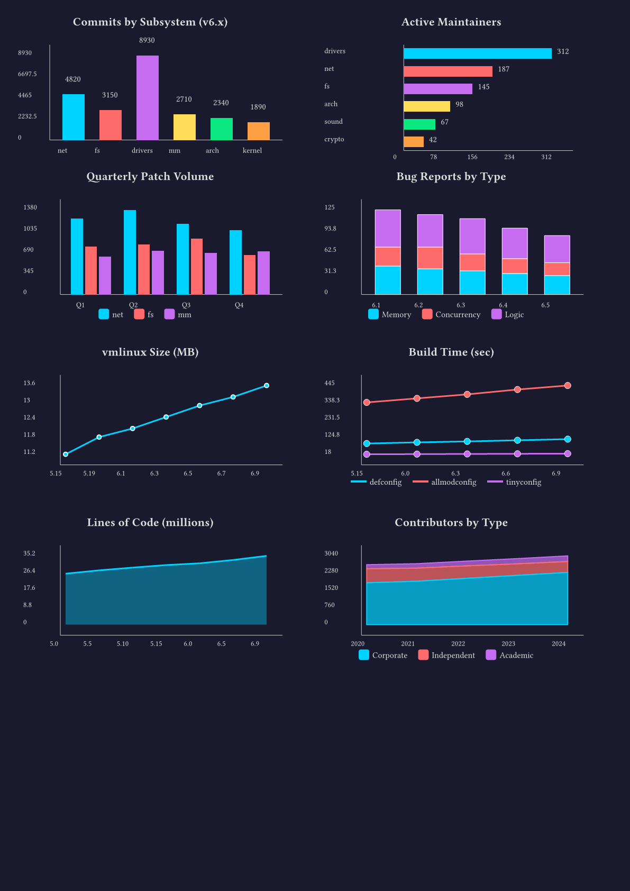
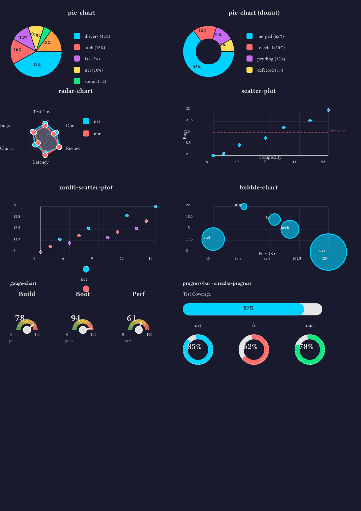

# Typst Charts

[](LICENSE)
[](https://typst.app)
[](screenshots/)
[]()

A charting library for [Typst](https://typst.app) built entirely with native primitives (`rect`, `circle`, `line`, `polygon`, `place`). No external dependencies required.

## Showcase

All 25+ chart types on 2 pages (Linux kernel subsystem data, dark theme):




## Features

- **25+ chart types** for data visualization
- **JSON data input** - load data directly from JSON files
- **Theme system** - preset themes and custom overrides for consistent styling
- **Customizable** - colors, sizes, labels, legends
- **Pure Typst** - no packages or external tools needed

## Chart Types

### Bar Charts
- `bar-chart` - Vertical bar chart
- `horizontal-bar-chart` - Horizontal bar chart
- `grouped-bar-chart` - Side-by-side grouped bars
- `stacked-bar-chart` - Stacked bar segments

### Line & Area Charts
- `line-chart` - Single line with points
- `multi-line-chart` - Multiple series comparison
- `area-chart` - Filled area under line
- `stacked-area-chart` - Stacked area series

### Circular Charts
- `pie-chart` - Pie chart with legend
- `pie-chart` (donut mode) - Donut/ring chart
- `radar-chart` - Spider/radar chart

### Scatter & Bubble
- `scatter-plot` - X/Y point plotting
- `multi-scatter-plot` - Multi-series scatter
- `bubble-chart` - Scatter with size dimension

### Gauges & Progress
- `gauge-chart` - Semi-circular dial gauge
- `progress-bar` - Horizontal progress bar
- `circular-progress` - Ring progress indicator
- `progress-bars` - Multiple comparison bars

### Sparklines (inline)
- `sparkline` - Tiny line chart for tables and text
- `sparkbar` - Tiny bar chart
- `sparkdot` - Tiny dot chart

### Heatmaps
- `heatmap` - Grid heatmap with color scale
- `calendar-heatmap` - GitHub-style activity grid
- `correlation-matrix` - Symmetric correlation display

### Statistical
- `waterfall-chart` - Bridge/waterfall chart with pos/neg/total segments
- `funnel-chart` - Conversion funnel with percentages
- `box-plot` - Box-and-whisker distribution plot

### Annotations
Overlay reference lines, bands, and labels on bar, line, and scatter charts:
- `h-line` - Horizontal reference line (target, average, threshold)
- `v-line` - Vertical reference line
- `h-band` - Horizontal shaded region (goal zone, range)
- `label` - Text label at a data point

## Installation

### Package (when published)

```typst
#import "@preview/charting:0.1.0": *
```

### Local

Copy the `src/` folder into your project, then import the library entrypoint:

```typst
#import "src/lib.typ": *
```

## Usage

```typst
#import "src/lib.typ": *

// Load data from JSON
#let data = json("mydata.json")

// Create a bar chart
#bar-chart(
  (
    labels: ("A", "B", "C", "D"),
    values: (25, 40, 30, 45),
  ),
  width: 300pt,
  height: 200pt,
  title: "My Chart",
)

// Create a pie chart
#pie-chart(
  (
    labels: ("Red", "Blue", "Green"),
    values: (30, 45, 25),
  ),
  size: 150pt,
  donut: true,
)

// Create a radar chart
#radar-chart(
  (
    labels: ("STR", "DEX", "CON", "INT", "WIS", "CHA"),
    series: (
      (name: "Fighter", values: (18, 12, 16, 10, 13, 8)),
      (name: "Wizard", values: (8, 14, 12, 18, 15, 11)),
    ),
  ),
  size: 200pt,
  title: "Character Comparison",
)
```

## Theming

Every chart function accepts an optional `theme` parameter. Themes control colors, font sizes, grid lines, backgrounds, and other visual properties.

### Using a preset theme

```typst
#import "src/lib.typ": *

#bar-chart(data, theme: themes.dark)
```

### Custom overrides

Pass a dictionary with only the keys you want to change. Unspecified keys fall back to the default theme:

```typst
#bar-chart(data, theme: (show-grid: true, palette: (red, blue, green)))
```

### Available presets

| Preset | Description |
|---|---|
| `themes.default` | Tableau 10 color palette, no grid, standard font sizes |
| `themes.minimal` | Lighter axis strokes, grid enabled, regular-weight titles |
| `themes.dark` | Dark background (`#1a1a2e`), vibrant neon palette (cyan, pink, purple, ...) |
| `themes.presentation` | Larger font sizes across the board for slides and projectors |
| `themes.print` | Grayscale palette with grid lines, optimized for black-and-white printing |

## Data Formats

### Simple data (labels + values)
```typst
(
  labels: ("Jan", "Feb", "Mar"),
  values: (100, 150, 120),
)
```

### Multi-series data
```typst
(
  labels: ("Q1", "Q2", "Q3"),
  series: (
    (name: "Product A", values: (100, 120, 140)),
    (name: "Product B", values: (80, 90, 110)),
  ),
)
```

### Scatter/bubble data
```typst
(
  x: (1, 2, 3, 4, 5),
  y: (10, 25, 15, 30, 20),
  size: (5, 10, 8, 15, 12),  // for bubble chart
)
```

### Heatmap data
```typst
(
  rows: ("Row1", "Row2", "Row3"),
  cols: ("Col1", "Col2", "Col3"),
  values: (
    (1, 2, 3),
    (4, 5, 6),
    (7, 8, 9),
  ),
)
```

## Examples

- `examples/showcase.typ` - Compact 2-page showcase of all chart types (dark theme, Linux kernel data)
- `examples/demo.typ` - Comprehensive 18-page demo with all features

Sample data files in `data/`:
- `data/characters.json` - RPG character data
- `data/events.json` - Conference/event data
- `data/analytics.json` - Dashboard analytics data

```bash
just demo       # Compile the full demo
just showcase   # Compile the 2-page showcase
just watch      # Live-reload during development
just check      # Run all compilation tests
just screenshots # Regenerate gallery images
```

## Color Palette

The default theme uses Tableau 10 colors. You can access colors from any theme via the `get-color` function:

```typst
#import "src/lib.typ": get-color, themes

// Default palette
#get-color(themes.default, 0)  // blue
#get-color(themes.default, 1)  // orange
#get-color(themes.default, 2)  // red

// Or use a theme preset
#get-color(themes.dark, 0)  // cyan
```

## Project Structure

```
typst-charts/
  src/
    lib.typ            # Public entrypoint - re-exports everything
    theme.typ          # Theme system and preset themes
    util.typ           # Shared utilities
    charts/            # One module per chart family
      bar.typ
      line.typ
      area.typ
      pie.typ
      radar.typ
      scatter.typ
      gauge.typ
      heatmap.typ
      sparkline.typ
      waterfall.typ
      funnel.typ
      boxplot.typ
    primitives/        # Low-level drawing helpers
      axes.typ
      annotations.typ
      container.typ
      legend.typ
      title.typ
    validate.typ       # Input validation helpers
  examples/
    showcase.typ       # 2-page compact showcase (dark theme)
    demo.typ           # Comprehensive 18-page demo
  data/                # Sample JSON data files
  screenshots/         # Gallery images
  justfile             # Common dev commands
```

## License

MIT
